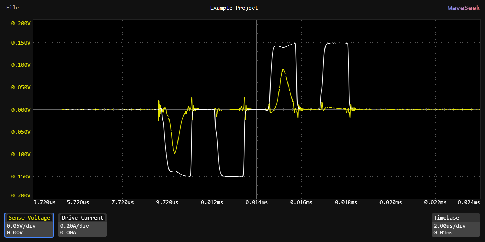

# Waveseek
A GPU accelerated waveform viewer for oscilloscope traces that can be easily embedded into any web page using an `<iframe>`.



## Getting started

To embed the waveform viewer into your HTML page:

```html
<iframe
  src="src/waveseek.html?dataURL=../examples/Example Project.waveseek"
  style="width: 100%; aspect-ratio: 18 / 9; border: none;">
</iframe>
```
Note that the dataURL can also be a full URL like https://example.com/data/example.waveseek

## Guide to user interface
To import new waveforms, click `File->Add Waveform from Siglent CSV` (Only Siglent CSV's are supported at this time).

To save the project for future use, click `File->Export Project` to export a .waveseek file.

To open a saved project, choose one of the following:
  - `File → Open Project from File` to load a local `.waveseek` file.
  - `File → Open Project from URL` to load a `.waveseek` file hosted online.

## Technical details
The `.waveseek` file is based on the **RIFF** (Resource Interchange File Format) specification.

Each file begins with a standard RIFF header and has the following structure:
```
RIFF ('wask '
    CHUNK ('cfgs' (project configuration JSON)),
    LIST ('wavs' (list of individual waveforms),
        LIST ('wave' (waveform configuration JSON),
            CHUNK ('cfgs' (waveform configuration JSON)),
            CHUNK ('wavd' (waveform binary data))
        ),
        LIST ('wave' (waveform configuration JSON),
            CHUNK ('cfgs' (waveform configuration JSON)),
            CHUNK ('wavd' (waveform binary data))
        ),
        ...
     )
)
```